# NextBand

[English](./README.md) | [中文](./README_zh.md) | [日本語](./README_ja.md)

---

NextBand は、次世代のスマートウェアラブルデバイスに向けたオープンソースプロジェクトであり、ヘルスセンシング、音声インタラクション、AIエージェントを統合した新しいウェアラブルインタラクションの可能性を探求しています。  
リストバンドや腕時計の形態で、心拍数や血中酸素濃度などのセンサーをクラウドベースの AI エージェントに接続し、デバイスがユーザーの状態を把握し、意図を理解したうえで、ユーザーに代わってさまざまなアクションを実行できるようにします。  

紹介記事: [medium](https://medium.com/@huangmipi/open-source-nextband-exploring-the-next-generation-of-wearable-devices-with-health-sensing-voice-75030a5b57f9), [csdn](https://blog.csdn.net/huangmipi/article/details/163773486?spm=1001.2014.3001.5502)  
紹介動画: [bilibili](https://www.bilibili.com/video/BV19qgP6fE4u/)

## ✨ 機能

- **健康モニタリング** — MAX30102 による心拍数モニタリング
- **音声コマンド** — 意図を話すだけで、AI Agent が代わりに実行します

## 🧱 アーキテクチャ



## 🧰 ハードウェア

| コンポーネント | 型番          | 備考                          |
| -------------- | ------------- | ----------------------------- |
| MCU            | ESP32-S3 N16R8 | 16 MB Flash、8 MB PSRAM       |
| ディスプレイ   | ST7735 LCD    | 128×128 TFT、4 ボタン付き     |
| 心拍センサー   | MAX30102      | 心拍 + SpO₂ センサー          |
| マイク         | INMP441       | I²S デジタル MEMS マイク      |
| ブレッドボード | MB-102        | プロトタイピング              |

### 📌 ピン配置

#### ST7735（4 ボタン付き LCD）

| ESP32-S3 | ST7735 | 機能           |
| -------- | ------ | -------------- |
| GPIO-12  | SCL    | SPI クロック   |
| GPIO-11  | SDA    | SPI データ     |
| GPIO-4   | RST    | リセット       |
| GPIO-5   | DC     | データ/コマンド |
| GPIO-6   | CS     | チップセレクト |
| GPIO-7   | K4     | ボタン 4       |
| GPIO-15  | K3     | ボタン 3       |
| GPIO-16  | K2     | ボタン 2       |
| GPIO-17  | K1     | ボタン 1       |

#### MAX30102（心拍 & SpO₂）

| ESP32-S3 | MAX30102 | 機能           |
| -------- | -------- | -------------- |
| GPIO-8   | SCL      | シリアルクロック |
| GPIO-18  | SDA      | シリアルデータ   |

#### INMP441（マイク）

| ESP32-S3 | INMP441 | 機能           |
| -------- | ------- | -------------- |
| GPIO-9   | SCK     | シリアルクロック |
| GPIO-46  | SD      | シリアルデータ   |
| GPIO-10  | WS      | ワードセレクト   |

### 🔌 ファームウェアの書き込み

ファームウェアは `hardware/arduino/main/` にあり、Arduino IDE でコンパイルおよび書き込みを行います。

#### 1. Arduino IDE のインストール

[arduino.cc](https://www.arduino.cc) から最新の Arduino IDE 2.3.x をダウンロードしてインストールします。

#### 2. 依存関係のインストール

- ESP32 ボードサポートのインストール：**Tools → Board → Boards Manager** で `esp32`（Espressif Systems 製）を検索してインストールします。
- **Tools → Manage Libraries** から必要なライブラリをインストールします：

  - `Adafruit GFX Library`
  - `Adafruit ST7735 and ST7789 Library`
  - `U8g2`
  - `U8g2_for_Adafruit_GFX`
  - `DevLab_MAX30102`

#### 3. ファームウェアを開く

Arduino IDE で `hardware/arduino/main/main.ino` を開きます。

#### 4. ボードの選択

| 設定               | 値                           |
| ------------------ | ---------------------------- |
| ボード             | ESP32S3 Dev Module           |
| パーティション方式 | 16M Flash (3MB APP/9.9MB FATFS) |
| Flash サイズ       | 16MB (128Mb)                 |
| PSRAM              | OPI PSRAM                    |

#### 5. 設定

`hardware/arduino/main/task.cpp` を編集します：

```cpp
#define IOT_HOST "https://your-server"
...
const char *WIFI_SSID = "your-wifi-ssid";
const char *WIFI_PASS = "your-wifi-password";
```

#### 6. コンパイルと書き込み

1. USB で ESP32-S3 を接続し、ポートを選択します。
2. **Upload** をクリックします。
3. 115200 ボーでシリアルモニタを開きます - ログが表示されるはずです。

## 💻 ソフトウェア

ソフトウェアはローカルテスト用に Windows と macOS をサポートしています。  
本番環境へのデプロイには Linux を使用してください。

### 🧩 サーバー技術

| レイヤー      | 技術             |
| ------------- | ---------------- |
| Ubuntu        | 22.04 LTS 64bit  |
| Python        | 3.10 & venv      |
| Web サーバー  | Tornado 6.5.4    |
| Docker        | 29.1             |
| AI Agent      | pi-mono 0.79.1   |

### 🚀 サーバーデプロイ

> **対象 OS:** Ubuntu Server 22.04 LTS（64bit）  
> **前提条件:** Docker 29.1、Python 3.10、python3.10-venv  

#### 1. プロジェクトファイルのアップロード

サーバー上に `/next-band` ディレクトリを作成し、プロジェクトの `server/` と `workspace/` ディレクトリをアップロードします。

#### 2. Docker REST API の有効化

```bash
sudo systemctl edit docker.service
```

以下の設定を追加します：

```ini
[Service]
ExecStart=
ExecStart=/usr/bin/dockerd -H unix:///var/run/docker.sock -H tcp://127.0.0.1:2375
```

**注意:** ローカルテストの場合は、代わりに `tcp://0.0.0.0:2375` を使用してください。

その後、変更を適用します：

```bash
sudo systemctl daemon-reload
sudo systemctl restart docker
sudo systemctl status docker
```

#### 3. Docker イメージのビルド

```bash
cd /next-band/server/pi-image

# 標準ビルド
docker build -t pi_bpm .

# 中国国内ユーザー向け（Tencent Cloud ミラー）
docker build --build-arg MIRROR=TC -t pi_bpm .
```

#### 4. サーバーの設定

`/next-band/server/my-agent/conf.prod.json` を編集し、API キーやその他の必要なパラメータを記入します。  
サーバーは Linux 上で実行される際、自動的に `conf.prod.json` を読み込みます。

#### 5. サーバーの起動

```bash
cd /next-band/server/my-agent

python3 -m venv .venv
source .venv/bin/activate
pip install -r requirements.txt
python main.py
```

サーバーは設定されたポート（デフォルト `3006`）で起動します。

## 📡 API エンドポイント

| メソッド | パス               | 説明                                 |
| -------- | ------------------ | ------------------------------------ |
| `GET`    | `/set-heart-rate`  | バンドから心拍数データをアップロード |
| `POST`   | `/set-wants-audio` | 意図解析のための音声録音をアップロード |

## 📂 プロジェクト構成

```text
NextBand/
├── hardware/
│   ├── arduino/main/      # ESP32-S3 ファームウェアのソースコード
│   └── EDA/               # Fritzing 配線図とピンリファレンス
├── server/
│   ├── my-agent/          # Tornado API サーバー
│   ├── pi-image/          # AI Agent ランタイム用 Docker イメージ
│   └── pi-mono/           # AI Agent 設定
├── workspace/             # ユーザーごとのワークスペースデータ
```

## 🌐 応用シナリオ

本ソリューションは、より高度なさまざまなユースケースへ拡張できます。例えば：

1. 健康・高齢者ケア・独居安全モニタリング
   - 事前に設定した条件を満たした際に、高齢者の緊急連絡先へ自動的に通知します
   - 転倒検知と統合することで、安全対応を自動的に発動できます
2. フィットネス・日常の健康管理
   - 「心拍数が 160 bpm を超えたら、運動強度を下げるようリマインドして」
   - 「心拍数が数晩続けて正常範囲を外れた場合、健康診断の予約を検討するようリマインドして」
3. パーソナル AI アシスタント
   - 健康データにとどまらず、リストバンドが AI エージェントの入口になります
   - 将来的にはスマートホームや企業システムなどと接続し、真の「感知 + 意思決定 + 実行」を実現します

---

## 🤝 お問い合わせ

Email: [huangmipi@gmail.com](mailto:huangmipi@gmail.com)  
Wechat: hmp750
